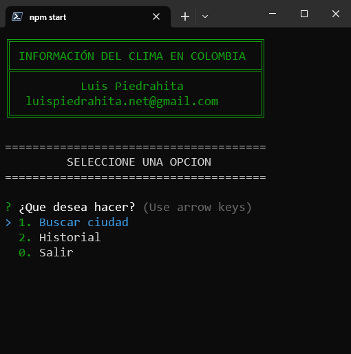
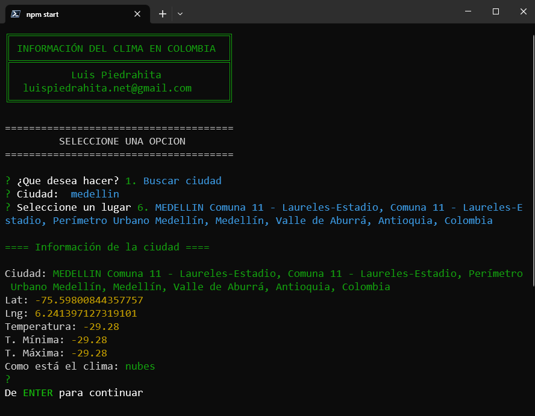

<h2 align="center">Información del clima en Colombia</h2>

Esta es una aplicación desarrollada con NodeJS para consultar el estado del clima de las pricipales ciudades de Colombia y que interactua con el usuario a través de la terminal 

 

<h3>Características</h3>

<ul>
<li>Hace consumo de la API de Maptiler para consultar las ciudades y las coordenadas</li>
<li>Utiliza la API de OpenWeather para consultar el clima</li>
<li>Guarda los datos en formato json en el disco local</li>
</ul>

<h3>Instalación</h3>

Renombrar el archivo ejemplo.env por .env

Poner tus claves en las variables de entorno del archivo .env

> MAPTILER_KEY=clave_de_tu_cuenta

> OPENWEATHER_KEY=clave_de_tu_cuenta

Instale las dependencias y arranque la aplicación con el siguiente comando:

> npm start
